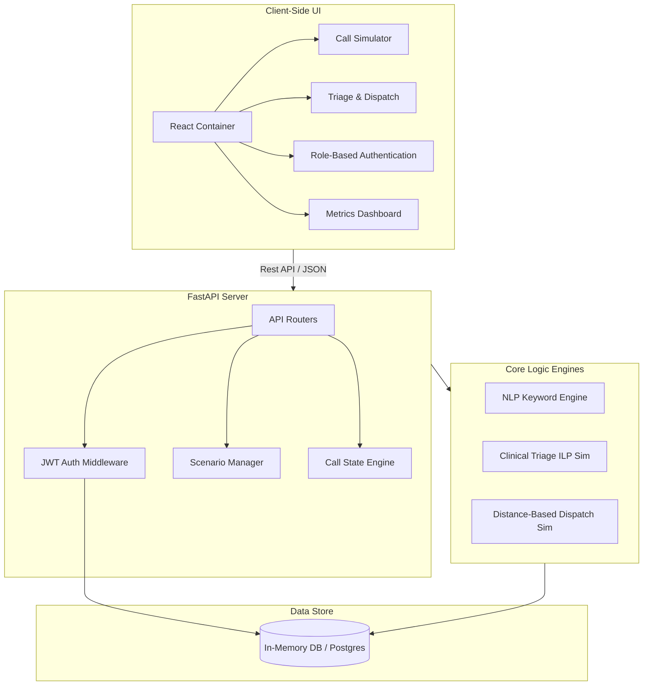

<div align="center">
  
# 🏥 AI Hospital IVR Web Simulator
**Next-Generation Interactive Voice Response Simulator for Healthcare**

[](https://fastapi.tiangolo.com/)
[](https://reactjs.org/)
[](https://www.typescriptlang.org/)
[](https://www.python.org/)
[](https://jwt.io/)

*An advanced, deterministic, AI-driven simulator for triaging, scheduling, and emergency dispatch, built with a modern Python/React stack.*

</div>

---

## ⚡ Overview

The **AI Hospital IVR Simulator** is a full-stack web application designed to emulate advanced real-world health interactive voice response (IVR) systems. It bridges the gap between state-of-the-art NLP interpretation and critical healthcare operations like **clinical triage assessment**, **appointment lifecycle management**, and **algorithmic ambulance dispatching**. 

Featuring custom **JWT Role-Based Access Control (RBAC)**, real-time deterministic rule engines simulating integer linear programming (ILP) solvers, and a deeply interactive React frontend.

---

## 🏗 System Architecture

The project leverages a decoupled architecture. A lightning-fast **FastAPI** backend orchestrates the business logic, JWT authentication, and IVR logic, serving a highly responsive **React + Vite** frontend.



---

## 🔥 Key Features

### 🎙️ Core IVR Flow Execution
* **Dynamic Call Simulation:** Start IVR calls, type simulated voice inputs, and receive real-time analyzed responses.
* **Persistent States:** Every interaction is securely captured, updating call transcripts, NLP intent recognition, and database states concurrently.

### 🧠 Intelligent NLU & Triage
* **NLU Analyzer:** Highly specialized natural language understanding optimized for medical intents, entity extraction, and sentiment tracking.
* **Algorithmic Triage:** Simulates SCIP (Solving Constraint Integer Programs) to assess patient clinical severity against real-time hospital resource availability.

### 🚑 Emergency Dispatch System
* **Fleet Management Simulator:** Emulates Gurobi mathematical models to compute distance-based assignments for ambulance fleet optimization.
* **Real-time Lifecycle:** Trace vehicles from standby, dispatched, en-route, to cleared statuses.

### 🔐 Secure Identity Management
* **Custom JWT RBAC:** Fully migrated off legacy providers (Clerk) into a robust, internally managed Bcrypt-hashed authentication flow.
* **Role Segregation:** Distinct login paths, isolated administrative views, and standard patient functionalities.

---

## 🚀 Quick Start Guide

### Prerequisites
You'll need **Node.js (v18+)** and **Python 3.10+**.

### One-Click Launch (Windows)
Run both services instantly via the included batch script:
```bat
run-all.bat
```

### Manual Setup & Execution

**1️⃣ Stand up the Backend API:**
```bash
cd simulator/backend
python -m venv venv
venv\Scripts\activate
pip install -r requirements.txt
uvicorn main:app --reload --port 8000
```
> The API will now listen on `http://localhost:8000`. Full OpenAPI Swagger docs available at `/docs`.

**2️⃣ Ignite the Frontend:**
```bash
cd simulator/frontend
npm install
npm run dev
```
> The React SPA will be accessible at `http://localhost:5173`. Proxies handle CORS targeting the local `8000` port.

---

## 🧩 Modularity at a Glance

| Deep-Dive Module       | Description | Context / Tech Use |
| :------------------- | :---------- | :----------------- |
| **Call Simulator**   | IVR lifecycle manager with NLU insights. | `Pydantic` validation over `REST` |
| **Scenario Manager** | CRUD for hospital conditions. | `Vite` + Custom API Client |
| **Triage Assessment**| Rule-based ILP evaluation. | Weighted logical constraints |
| **Analytics Engine** | High-level operations overview. | Aggregated history metrics |

---

## 🛡️ API Architecture

Boasting **31 dedicated endpoints**, structured logically across domains:

* **Authentication (RBAC):** `/api/auth/register`, `/api/auth/login`, etc.
* **Telephony State:** `/api/calls/start`, `/api/calls/{id}/input`
* **NLP Pipeline:** `/api/nlu/analyze`, `/api/nlu/batch`
* **Hospital Logistics:** `/api/triage/assess`, `/api/dispatch/assign`
* **System Meta:** `/api/menu`, `/` (Healthcheck)

---

## 🛠️ Technology Stack Breakdown

<details>
<summary><b>Click to Expand Full Stack Map</b></summary>
<br>

| Layer | Component | Description |
| :--- | :--- | :--- |
| **Backend Framework** | `FastAPI (v0.115)` | Asynchronous Python framework with auto-generated schemas. |
| **Data Validation** | `Pydantic v2` | Strict request/response parsing and model typing. |
| **Frontend Rendering** | `React 18` + `TypeScript` | Strongly-typed interface definitions and modular React components. |
| **Build & Tooling** | `Vite 5` | Under-300ms HMR and optimized production bundling. |
| **Security** | `JWT` + `Bcrypt` | Tokenized headers and salted credential hashing. |
| **Routing** | `React Router v6` | Protected route wrappers and layout injection. |

</details>

---

<p align="center">
  <i>Built for the future of automated healthcare orchestration.</i>
</p>
